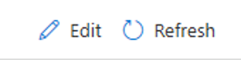
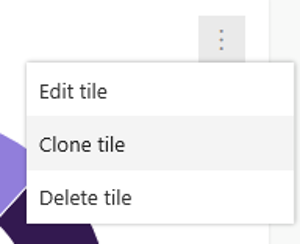
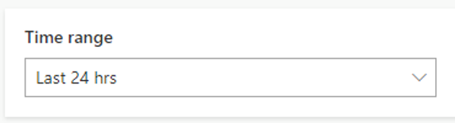
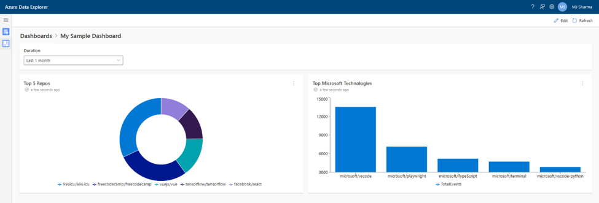

# 2 - Add additional tiles by cloning existing tiles

1. Switch to Edit mode on your dashboard by clicking `Edit` on the top right of the command bar.



2. Click `Clone tile` on the `Top 5 Repos` tile to duplicate it.



3. On the newly created tile, click `Edit tile` and update the query as follows:

```
// Let's see what Microsoft technologies have the most traction in GitHub
EventsAll
| where Repo.name has 'Microsoft'
| summarize TotalEvents = count() by RepoName=tolower(tostring(Repo.name))
| top 5 by TotalEvents
```

4. Click `Run` to see the results of this query.

5. Every dashboard has a `Time range` picker by default. So far, we haven't used it in our queries. Update this query to work with the `Time range` picker, by using the keywords `startTime` and `endTime` as follows:

```
// Let's see what other Microsoft technologies have the most traction in GitHub
EventsAll
| where Repo.name has 'Microsoft'
| where CreatedAt between (_startTime.._endTime)
| summarize TotalEvents = count() by RepoName=tostring(Repo.name)
| top 5 by TotalEvents
```
6. Once you do this, you will see the `Time range` picker enabled:



Choose a different value to see the chart update.

7. Change the chart type to `Column` chart and name it `Top Microsoft Technologies`. Click `Done` to exit the tile editing experience and go back to the dashboard.

8. Move this new tile to the right of your previous tile, resize it to occupy all of the remaining width and save your dashboard.



9. Use the `Time range` picker to have the column chart update accordingly.

# Go back to [1 - Create a sample dashboard](1-CreateSampleDashboard.md) or proceed to [3 - Add tiles by pinning a query to a dashboard](3-PinQuery.md)
