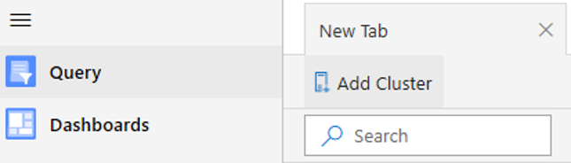
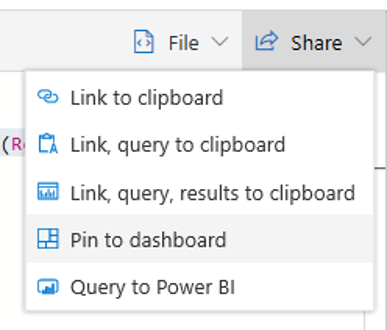
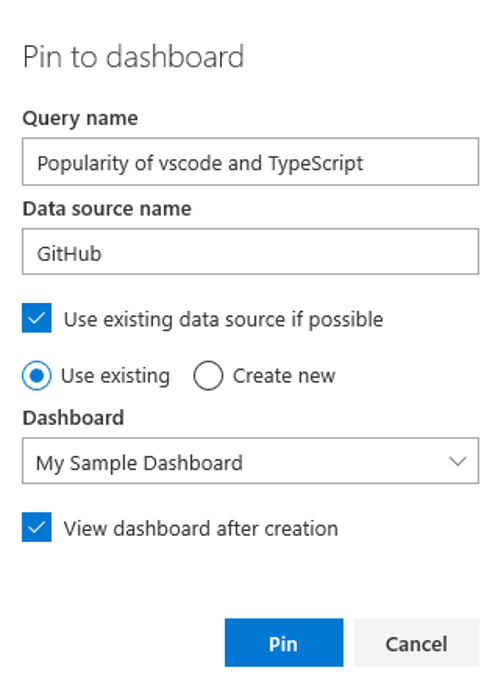
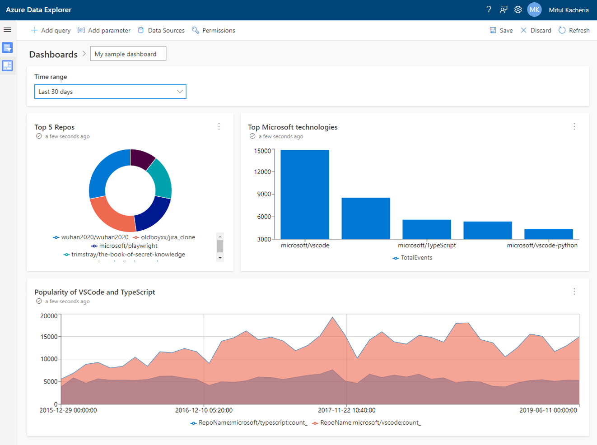

# 3 - Add a tile to the dashboard by pinning a query

1. Navigate to the `Query` experience by clicking in the left navigation menu. Click `Add Cluster` and provide the same details used earlier:

- `Cluster URI`: `https://demo11.westus.kusto.windows.net/`
- `Database`: `GitHub`



2. Let's use the following query:

```
// Let's see the popularity trend of vscode and typescript
EventsAll
| where Repo.name =~ "Microsoft/vscode" or Repo.name =~ "Microsoft/TypeScript"
| make-series count() default=0 on CreatedAt in range(datetime(2016-01-01), datetime(2019-06-11), 30d) by RepoName = tolower(tostring(Repo.name))
| project CreatedAt, RepoName, count_
```

3. To add the query to our existing dashboard, click the `Pin to dashboard` option in the `Share` menu.



4. Fill in the form, as shown below and click `Pin`.



5. The newly added visual now appears on your dashboard. By default, the tile shows a table visual. Edit it to make it an `Area` chart and save your dashboard. It should look as shown below.



# Go back to [2 - Add additional tiles by cloning existing tiles](2-CloneTile.md) or proceed to [4 - Explore data on existing tiles in a dashboard](4-Explore.md)
