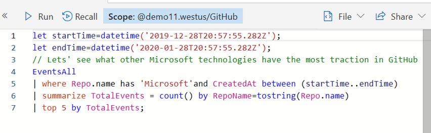

# 4 - Explore an existing tile in a dashboard

1. Click `Explore tile` in the tile options for the `Top Microsoft technologies` tile to see the query and results in the Query experience.

2. Note that the time range is carried over as variables to maintain a consistent experience.

# Go back to [3 - Add tiles by pinning a query to a dashboard](3-PinQuery.md) or proceed to [5 - Create and use a parameter in a query and the dashboard](5-UseParameters.md)
