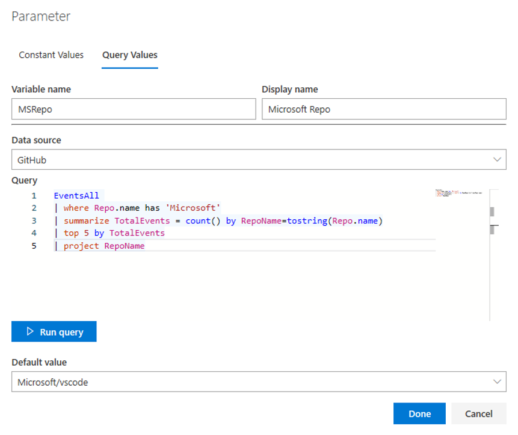
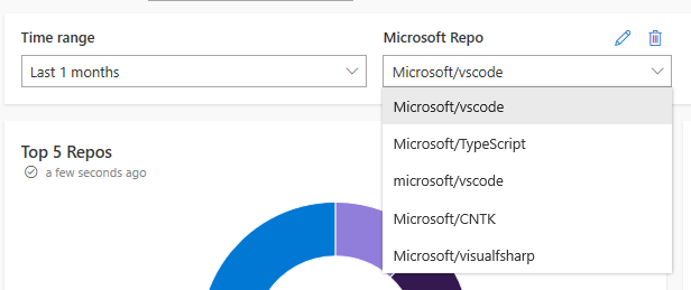

# 5 - Create and use a parameter in query and dashboard

1. Use the browser `Back` button to navigate back to your dashboard. Alternatively, you can click `Dashboards` in the left navigation menu and then click on your dashboard.

2. Click `Edit` to enter edit mode.

3. Click `Add Parameter` in the dashboard command bar.

4. Select the `Query Values` pivot.

5. Enter `MSRepo` as the `Variable name` and `Microsoft Repo` as the `Display name`.

6. Select `Github` as the `Data source`, if not already selected.

7. Enter the following query:
```
// Let's get the top 5 Microsoft repos
EventsAll
| where Repo.name has 'Microsoft'
| summarize TotalEvents = count() by RepoName=tostring(Repo.name)
| top 5 by TotalEvents
| project RepoName
```


8. Click `Run query` to fetch the results and populate the dropdown. Select `Microsoft/vscode` as the `Default value`.

9. Click `Done`. You should now see this new parameter next to the `Time range` picker.

10. Clone the `Popularity of vscode and TypeScript` tile and edit its query to use the newly created parameter and save it as a `Time Chart`.
```
// Let's see the popularity trend for a specific repo
EventsAll
| where Repo.name == MSRepo
| make-series count() default=0 on CreatedAt in range(datetime(2016-01-01), datetime(2019-06-11), 30d) by RepoName = tolower(tostring(Repo.name))
| project CreatedAt, RepoName, count_
```

11. Change the value of the parameter in the dashboard to see the chart update.


# Go back to [4 - Explore data on existing tiles in a dashboard](4-Explore.md) or proceed to [Bonus exercises](BonusExercises.md)
